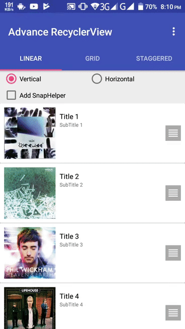

# RecyclerView Advance Use

Sample code for RecyclerView Advance use.

Implemented:
--------------------
  *  Swipe Delete item
  *  Drag to reorder item
  *  Shuffle item with DiffUtil
  *  SnapHelper

  LayoutManager:
-----------------------
  * LinearLayoutManager
  * GridLayoutManager
  * StaggeredGridLayoutManager

  Screenshots:
--------------

* LinearLayoutManager:

* GridLayoutManager:

* StaggeredGridLayoutManager:

* Shuffle with DiffUtil:

